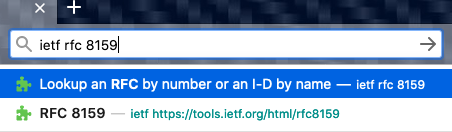

An add-on to help with opening IETF RFCs, BCPs, STDs, and Internet-Drafts.  Designed for Firefox version 52 or higher.

**[Get it here]({{ site.download_url }})**

## Using

To use this add-on, go to the Awesome bar and start typing `ietf` followed by:
* the RFC number (e.g., `ietf rfc 8259`); or
* the BCP number (e.g., `ietf bcp 190`); or
* the STD number (e.g., `ietf std 90`); or
* the Internet-draft name (e.g., `ietf draft-ietf-jsonbis-rfc7159bis`)

Click on the best match from the dropdown of suggestions, or hit `enter` to let the add-on pick. 
